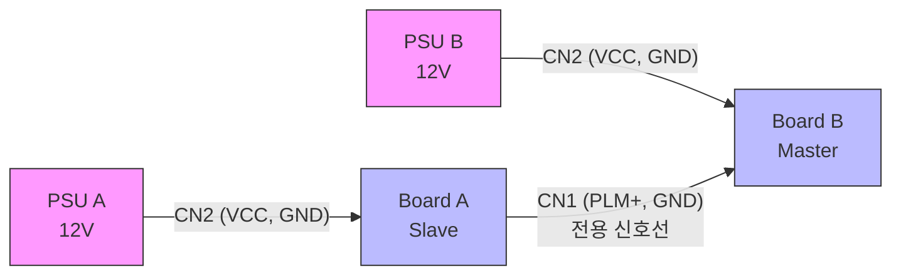
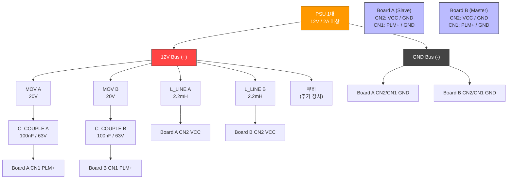
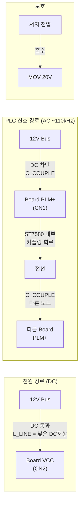
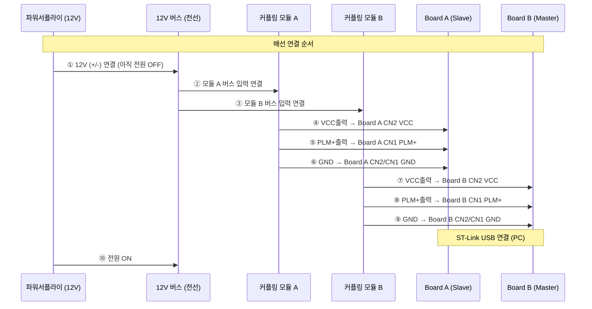
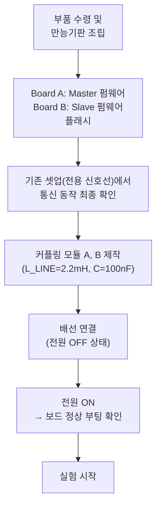
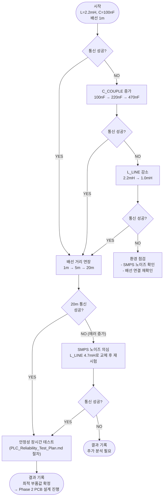
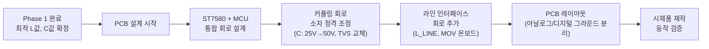

# Phase 1: 12V DC 파워 라인 PLC 커플링 실험

> **목표**: X-NUCLEO-PLM01A1 평가 보드를 12V DC 공유 전원 버스에 연결하여
> 전용 신호선 없이 전원선만으로 ST7580 PLC 통신 동작을 검증한다.

---

## 1. 현재 셋업 vs 목표 셋업 비교

### 현재 셋업 (전용 신호선 방식)



- 전원: PSU 2대 (각각 독립)
- 통신: CN1 ↔ CN1 전용 물리 선
- **문제**: 실제 제품에서 전원선과 통신선이 분리된 구성은 배선 비용 증가

---

### 목표 셋업 (전원선 공유 방식)



---

## 2. 외부 커플링 네트워크 회로도 (1개 노드 기준)

> 평가 보드 1개당 동일한 커플링 회로를 1세트씩 제작. 총 2세트 필요.

```
12V Bus (+) ─────────┬───────────────────────────────── 다른 노드 / 부하
                     │
                  [L_LINE]   ← 전원 경로에 삽입 (DC 통과, PLC 신호 격리)
                  2.2mH / 1A
                     │
                     ├──────────────── Board CN2 (VCC)
                     │
                  [MOV]      ← 버스 서지 보호
                  20V Disc
                     │
                  [C_COUPLE] ← DC 차단 / PLC 신호 통과
                  100nF / 63V
                     │
                     └──────────────── Board CN1 (PLM+)

GND Bus (-) ─────────────── Board CN2 (GND) = Board CN1 (GND)
```

### 신호 경로 분석



### 각 소자 임피던스 @ 110kHz (CENELEC B 밴드 중심)

| 소자 | 값 | 임피던스 @ 110kHz | 역할 |
|---|---|---|---|
| L_LINE | 2.2mH | **$X_L = 2\pi \times 110k \times 2.2m \approx 1,520\,\Omega$** | PLC 신호가 전원 공급부로 역류 차단 |
| C_COUPLE | 100nF | **$X_C = \frac{1}{2\pi \times 110k \times 100n} \approx 14.5\,\Omega$** | DC 차단, AC 신호 통과 |
| MOV | 20V | ∞ (정상시) / ≈0 (서지시) | 과도 전압 흡수 |

> **L_LINE이 커야 하는 이유**: SMPS 전원 공급 장치는 내부 임피던스가 수 Ω 이하로 매우 낮음.
> L_LINE 없이 연결하면 PLC 신호가 전원 공급부로 흡수(단락)되어 통신 불가.

---

## 3. 배선도

### 브레드보드/만능기판 배선 (실습용)

```
                ┌─────────────────────────────────┐
                │      커플링 네트워크 모듈 A       │
                │                                  │
 BUS(+) ───IN+──┤──[L_LINE 2.2mH]──┬──── OUT+ ───CN2 VCC
                │                  │               │
                │               [MOV]              │
                │                  │               │
                │              [C_COUPLE]──────────CN1 PLM+
                │               100nF              │
 BUS(-) ───IN-──┤────────────────────── OUT- ───CN2/CN1 GND
                │                                  │
                └─────────────────────────────────┘

 ※ 모듈 B도 동일하게 제작, 같은 BUS에 병렬 연결
```

### 전체 배선 연결 순서



---

## 4. 부품 목록 (BOM)

### ① L_LINE — 인덕터 (튜닝 변수, 여러 값 구매)

> 통신 거리, SMPS 노이즈 환경에 따라 교체하며 최적값 탐색

| 파트넘버 | 값 | 전류 | 용도 | 수량 |
|---|---|---|---|---|
| `RLB1314-102KL` | 1.0mH | 1.1A | 격리 약함 (노이즈 적은 환경) | 각 2개 |
| `RLB1314-222KL` | **2.2mH** | 0.87A | **기본 시작값 ✓** | 각 2개 |
| `RLB1314-472KL` | 4.7mH | 0.6A | 격리 강함 (SMPS 노이즈 심한 환경) | 각 2개 |

- **제조사**: Bourns
- **패키지**: Radial through-hole (리드선 관통형)
- **구매처**: [Mouser Korea](https://kr.mouser.com) → 검색: `RLB1314`
- **대체 선택지**: Murata LHL 시리즈, Sumida CDRR 시리즈

---

### ② C_COUPLE — 커플링 커패시터 (튜닝 변수, 여러 값 구매)

> DC 12V 차단하면서 110kHz PLC 신호 통과. 반드시 **필름 커패시터** 사용.

| 값 | $X_C$ @ 110kHz | 신호 통과 특성 | 수량 |
|---|---|---|---|
| 47nF / 63V | ≈ 30.8Ω | 약함 | 5개 |
| **100nF / 63V** | ≈ 14.5Ω | **기본 시작값 ✓** | 5개 |
| 220nF / 63V | ≈ 6.6Ω | 강함 | 5개 |
| 470nF / 63V | ≈ 3.1Ω | 매우 강함 | 5개 |

- **추천 시리즈**: WIMA MKS2 또는 Kemet R82
- **주의**: 전해 커패시터 ❌, 세라믹(MLCC) ⚠️ (고주파 특성 확인 필요)
- **구매처**: [디바이스마트](https://www.devicemart.co.kr) → 검색: `필름 커패시터 100nF 63V`
- **대체**: YAGEO/Kemet MLCC X7R 100nF 50V (104, 50V 표기)

---

### ③ MOV — 서지 보호 바리스터

| 파트넘버 | 동작전압 | 에너지 | 수량 |
|---|---|---|---|
| `B72210S0200K101` (Epcos/TDK) | 20V DC | 1J | 4개 (여분 포함) |

- **패키지**: Disc 10mm, through-hole
- **구매처**: [아이씨뱅큐](https://www.icbanq.com) → 검색: `MOV 20V` 또는 `바리스터 20V`
- **대체**: Littelfuse V20ZA2P, Bourns MOV-10D201K

---

### ④ 실험 보조 부품

| 부품 | 규격 | 수량 | 구매처 |
|---|---|---|---|
| 유니버설 기판 | 70×50mm (2.54mm 피치) | 2장 | 디바이스마트 |
| 스크류 터미널 블록 | 2P, 5.08mm 피치 | 4개 | 디바이스마트 |
| 점퍼 핀 헤더 | 2P 수직형 2.54mm | 10개 | (인덕터 교체 편의용) |
| 악어클립 케이블 | 적/흑 각 1개 | - | 전자부품 상가 |

---

### 총 구매 비용 예상

| 항목 | 소계 |
|---|---|
| 인덕터 3종 × 2개 | ≈ 9,000원 |
| 필름 커패시터 4종 × 5개 | ≈ 4,000원 |
| MOV 4개 | ≈ 1,600원 |
| 기타 기판/터미널 | ≈ 5,000원 |
| **합계** | **≈ 20,000원** |

---

## 5. 실험 절차

### 5.1 실험 준비



### 5.2 튜닝 실험 흐름



### 5.3 판정 기준

| 지표 | 성공 기준 | 측정 방법 |
|---|---|---|
| ACK 수신 여부 | 연속 10회 중 8회 이상 ACK 수신 | VS Code LiveWatch `g_ack_count` |
| RTT (왕복 지연) | < 500ms (ST7580 처리 시간 포함) | DWT 타이머 측정 |
| UART 에러 | PE/FE/NE/ORE 합산 < 5% | `P2P_UART1_ErrorInc` 카운터 |

---

## 6. 측정 포인트 (오실로스코프 있는 경우)

> 없어도 실험 가능. 있으면 신호 레벨과 노이즈 확인에 유용.

```
측정 지점 1: Board CN1 PLM+ ↔ GND
  → PLC 신호 파형 확인 (110kHz 정현파)
  → 정상: 수 Vp-p, BPSK/FSK 변조

측정 지점 2: L_LINE 양단 (입력 vs 출력)
  → PLC 신호 감쇠 확인
  → L_LINE 값 조정 판단 근거

측정 지점 3: 12V Bus (+) ↔ GND
  → PLC 신호가 버스에 얼마나 실리는지 확인
  → 전압: 수백 mVp-p 예상
```

---

## 7. 참고 자료

| 문서 | 경로 |
|---|---|
| PLM01A1 회로도 | `docs/PLM01A1 datasheet/x-nucleo-plm01a1.pdf` |
| Getting Started UM2188 | `docs/PLM01A1 datasheet/um2188-...pdf` |
| 통신 신뢰성 실험 계획 | `docs/PLC_Reliability_Test_Plan.md` |
| 현재 펌웨어 애플리케이션 | `Core/Src/c_plc_appli.c` |
| ST7580 초기화 설정 | `Drivers/BSP/Components/ST7580/ST7580_Library/Src/ST7580_Serial.c` |

---

## 8. 실험 결과 (2026-05-14)

> **실험자 의도**: 외부 커플링 모듈 제작 전, PLM01A1 보드 내부 커플링만으로
> 12V 전원선 PLC 통신 가능 여부를 확인하는 **선행 실험** 진행.
> **보드 파손 위험을 인지한 상태에서 의도적으로 진행.**

### 8.1 선행 실험 배선 (외부 커플링 없음)

기존 계획(외부 L_LINE + C_COUPLE 모듈)을 적용하기 전,
PLM01A1 내부 커플링 회로만으로 전원선 통신이 가능한지 먼저 검증.

```
[기존 배선 - PLM 직결 (기준)]
  Master CN2 VCC ← PSU A (독립)
  Slave  CN2 VCC ← PSU B (독립)
  Master PLM CN1 ──────────── Slave PLM CN1

[선행 실험 배선 - VCC 경유 루프]
  PSU (12V) ──→ Slave CN2 VCC ──→ Slave PLM CN1
                                       │
                                  (PLC 신호 전달)
                                       │
                              Master CN2 VCC ──→ Master PLM CN1
```

**위험 요소**: PLM CN1에 12V DC가 직접 인가될 수 있어 내부 D4 TVS
(SM6T6V8CA, 클램프 ~6.8V) 파손 가능성. **사전 인지 후 진행.**

### 8.2 실험 경과

| 단계 | 현상 | 원인 분석 |
|------|------|----------|
| 최초 전원 인가 | ACK 수신됐으나 모두 실패 처리 ("밀리는 현상") | ST7580 초기화 직후 불안정 상태 추정. 새 배선 토폴로지에서 안정화 시간 부족. |
| 전원 재투입 | **100% 성공, RTT 148ms 안정 유지** | ST7580 재초기화 후 정상 동작. |

### 8.3 측정 결과

| 항목 | PLM 직결 (기준) | VCC 경유 선행 실험 | 변화 |
|------|---------------|--------------------|------|
| RTT (왕복 지연) | ~100~120ms | **148ms** | +48ms |
| 패킷 성공률 (PER) | 100% | **100%** | 동일 |
| UART 에러 | 0 | 0 | 동일 |
| 커플링 통과 횟수 | 2단 | **4단** | +2단 |
| TX/RX 카운터 | 일치 | **일치** | 동일 |
| 변조 방식 | BPSKCOD | BPSKCOD | — |

**RTT +48ms 증가 원인**: PLM01A1 내부 커플링 회로를 2회 추가 통과 (루프 양단 각 1단).
커플링 1단당 대역통과 필터 위상 지연이 누적됨.

$$\Delta T_{RTT} \approx 2 \times 24\text{ ms} \approx +48\text{ ms}$$

### 8.4 결론 및 시사점

1. ✅ **전원선 PLC 통신 가능 확인**: 외부 커플링 없이 PLM01A1 내부 커플링만으로
   12V 전원선 PLC 통신이 동작함 → 제품화 가능성 검증 완료.
2. ✅ **RTT 기준값 확보**: 직결 ~100ms 대비 전원선 경유 ~148ms
   → **커플링 1단 추가당 약 +24ms**.
3. ⚠️ **초기화 안정성 문제**: 최초 전원 인가 시 실패 현상 발생.
   `P2P_Init()` 내 대기 시간 연장 또는 ST7580 재시도 로직 보강 검토 필요.
4. ⚠️ **D4 TVS 파손 위험 내재**: 본 선행 실험은 보드 파손 위험을 감수한 것.
   Phase 2 PCB에서는 외부 C_COUPLE로 12V 직결 방지 필수.

### 8.5 Phase 2 설계 반영 사항

| 확정 항목 | 수치 | 근거 |
|-----------|------|------|
| 커플링 1단 추가 시 RTT 증가량 | +24ms | 선행 실험 측정 |
| PLM CN1 DC 직결 금지 | 12V 인가 불가 | D4 TVS 파손 위험 |
| 외부 C_COUPLE 필수 (DC 차단) | — | 기술적 필수 조건 확정 |
| 커플링 회로 내압 정격 | C ≥50V, TVS ≥15V | 12V 버스 직결 대응 |
| BPSKCOD 전원선 경유 성공 | 100% PER | 제품화 근거 확보 |

---

## 9. Phase 2 진행 조건

Phase 1 검증 완료 후, 아래 항목이 확정되면 ST7580 통합 자체 PCB 설계를 시작한다.



| 확정 항목 | 비고 |
|---|---|
| 최적 L_LINE 인덕턴스 값 | Phase 1 실험 결과 |
| 최적 C_COUPLE 용량 | Phase 1 실험 결과 |
| 최대 통신 거리 | Phase 1 실험 결과 |
| MCU 선택 (F446 유지 or 변경) | 기능/비용 고려 |
| 노드 수 (최종 제품) | 제품 사양 결정 |
