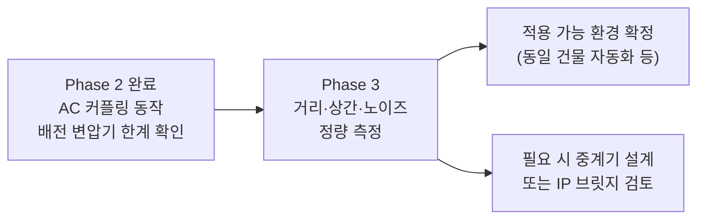

# Phase 2: 220V AC 전력선 PLC 통신 실험 (STEVAL-XPLM01CPL)

> **목표**: STEVAL-XPLM01CPL AC 커플링 보드를 사용하여 X-NUCLEO-PLM01A1을
> 220V 상용 전력선에 연결, ST7580 PLC 통신 가능 범위와 한계를 검증한다.

---

## 1. Phase 1 → Phase 2 변경점

### Phase 1 셋업 (12V DC 전원선)

```
PSU (12V DC) ──┬── Board A CN2 (VCC) ──→ Board A CN1 (PLM+)
               └── Board B CN2 (VCC) ──→ Board B CN1 (PLM+)
                   Board A CN1 ──────────── Board B CN1 (전용 신호선)
```

- 통신 매체: 12V DC 전원선 (공유 버스)
- 커플링: PLM01A1 내부 커플링 회로만 사용
- 결과: 100% 성공, RTT 148ms (§ Phase 1 §8 참조)

### Phase 2 셋업 (220V AC 상용 전력선)

```
220V AC 전력선 (L/N)
────────────────────────────────────────────────────
        │                                │
  STEVAL-A J1                      STEVAL-B J1
  [AC 커플링 회로]                  [AC 커플링 회로]
  STEVAL-A CN1                     STEVAL-B CN1
        │                                │
  PLM01A1-A CN1                    PLM01A1-B CN1
  (Master + LCD)                   (Slave)
        │                                │
  PLM01A1-A CN2                    PLM01A1-B CN2
      12V DC (별도 공급)              12V DC (별도 공급)
```

---

## 2. 실험 하드웨어 구성

### 장비 목록

| 장비 | 수량 | 역할 |
|---|---|---|
| X-NUCLEO-PLM01A1 (ST7580 모뎀) | 2 | PLC 송수신 |
| STEVAL-XPLM01CPL (AC 커플링 보드) | 2 | 220V 전력선 인터페이스 |
| NUCLEO-F446RE (STM32F446RE) | 2 | MCU 제어 |
| DC 전원 공급기 (12V) | 2 | PLM01A1 CN2 아날로그 전원 |

### STEVAL-XPLM01CPL 내부 회로 (커플링 경로)

```
J1 (220V AC)
  │
  F1 (4A 퓨즈)
  │
  SIOV1 (S14K320, 320V 바리스터) + D1 (SM6T15CA, 15V TVS)  ← 서지 보호
  │
  C2 (470nF X2 클래스)  ← DC 차단 / AC PLC 신호 통과
  │
  T1 (1:1 절연 트랜스포머)  ← 갈바닉 절연 + 신호 커플링
  │
  L1 (4.7µH 튜닝 인덕터)  ← 주파수 응답 조정
  │
  CN1 (SIGNAL_CONNECTOR)  ← PLM01A1 CN1 연결
```

**CN1 신호 특성**:
- DC 성분: 0V (트랜스포머 + C2 완전 차단)
- 50Hz 성분: 거의 0 (C2 @ 50Hz ≈ 6.77kΩ 고임피던스)
- PLC 신호 (95~125kHz): 최대 14 Vp-p (T1 1:1 비율 그대로 전달)

### 커넥터 결선

| STEVAL-XPLM01CPL | X-NUCLEO-PLM01A1 |
|---|---|
| **J1** (MAINS_CONNECTOR) | 220V AC 전력선 (L/N) |
| **CN1** pin 1 (SIGNAL) | **CN1** PLM+ |
| **CN1** pin 2 (GND) | **CN1** GND |
| — | **CN2** VCC: 12V DC 별도 공급 |

> **핀 1 확인 방법**: 멀티미터로 STEVAL CN1 핀 중 J1 N선과 통하는 쪽이 GND.
> PLM01A1 CN1 핀 중 CN2 GND(-)와 통하는 쪽이 GND. GND끼리 맞춰 연결.

---

## 3. 실험 결과

### 3.1 실험 케이스별 결과

| 케이스 | 구성 | 결과 | 비고 |
|---|---|---|---|
| **Case 1** | 두 보드를 동일 멀티탭에 연결 | ✅ **통신 OK** | 직결 수준, 신호 최단 경로 |
| **Case 2** | Master(LCD 포함)를 옆 사무실 콘센트 연결 | ✅ **통신 OK** | 수십 m, 동일 분전반 추정 |
| **Case 3** | Master를 약 150m 떨어진 다른 건물에 연결 | ❌ **통신 Fail** | 배전 변압기 차단 확인 |

### 3.2 Case 3 실패 원인 분석

**실패 원인: 건물 간 배전 변압기**

```
[이 건물]                         [다른 건물 ~150m]
  PLM01A1 A                         PLM01A1 B
      │                                 │
  STEVAL-A J1                      STEVAL-B J1
      │                                 │
    분전반                             분전반
      │                                 │
    수전반                             수전반
      │                                 │
      └──────── 배전 변압기 ───────────┘
               (22.9kV → 220V)

               ↑ PLC 신호가 이 지점에서 차단됨
```

배전 변압기의 CENELEC B 밴드(110kHz)에 대한 임피던스:

$$X_{L,transformer} = 2\pi \times 110\text{kHz} \times L_{leakage} \approx \text{수십 k}\Omega$$

ST7580이 사용하는 NB-PLC(협대역 전력선 통신)는 저압(LV) 배전망 전용 기술로,
**배전 변압기를 통과하지 못하는 것은 기술적 특성**이며 장비 결함이 아님.

---

## 4. 이론적 통신 거리 분석

### 4.1 링크 버짓

| 항목 | 값 | 비고 |
|---|---|---|
| ST7580 최대 송신 전력 | **14 Vp-p, 1 Arms** ≈ +13 dBm | PLM01A1 data brief |
| ST7580 수신 감도 | **약 −80 dBm** | AGC + BPSK FEC 포함 |
| 링크 버짓 | **~93 dB** | 송신−수신 감도 차 |

### 4.2 전력선 신호 감쇠 요인 (CENELEC B, ~110kHz)

| 감쇠 요인 | 감쇠량 |
|---|---|
| LV 케이블 (XLPE, 10mm²) | 3~10 dB / 100m |
| 분기점 (T 분기) 1개 | 3~6 dB |
| SMPS / 인버터 부하 1개 | 3~10 dB |
| 동상(Same phase) → 타상(Cross-phase) | **+15~20 dB 추가** |

### 4.3 환경별 예상 최대 통신 거리

```
동일 배전 변압기 하단 기준:

같은 상(Phase), 부하 최소, 직선 배선
  ├── 100m  : 감쇠 ~15 dB  → 여유 충분  ✅
  ├── 300m  : 감쇠 ~30 dB  → 정상 동작  ✅
  ├── 500m  : 감쇠 ~50 dB  → 조건부 가능 ⚠️
  └── 1km   : 감쇠 ~80 dB  → 한계      ❌

타 상(Cross-phase) 시: 위 거리의 약 1/3 수준
SMPS 부하 다수 환경: 위 거리의 약 1/2 수준
```

### 4.4 국내 3상 배전 환경 고려

한국 저압 배전: 3상 4선식 220/380V

```
배전 변압기 (22.9kV → 220V)
    │
  ┌─┴──────────────────┐
  A상    B상    C상    N(중성선)
  │      │      │
  │      │      │         ← 건물 내 분전반에서 상별 분배
  │      │
실험실(A상)  옆 사무실(B상)
                ↑
        상이 다를 경우 +15~20 dB 추가 감쇠
        → Case 2가 OK인 이유: 동상이거나 분전반 근접
```

### 4.5 Phase 1 결과와의 연속성

| 항목 | Phase 1 (12V DC) | Phase 2 (220V AC) |
|---|---|---|
| 커플링 방식 | 내부 회로만 (외부 커플링 없음) | STEVAL (1:1 트랜스포머 절연) |
| 통신 매체 | DC 전원 버스 (수십 cm) | AC 전력선 |
| RTT | 148ms (VCC 경유) | 미측정 (향후 측정 필요) |
| 최대 거리 | 수십 cm (벤치 실험) | 수십 m 확인 (Case 2) |
| 변압기 통과 | 해당 없음 | 불가 (Case 3 확인) |

---

## 4. 신뢰성 실험 결과 (장시간 연속 통신)

### 4.1 실험 조건

| 항목 | 값 |
|---|---|
| 실험 시간 | 약 1시간 20분 |
| 총 시도 횟수 | 4,256회 |
| 변조 방식 | BPSKCOD (FEC 포함) |
| 페이로드 크기 | 21 bytes |
| 연결 구성 | Case 1 (동일 멀티탭, 단거리) |

### 4.2 TMO 비교 — 직결 vs 220V AC 메인스

| 항목 | 직결 (PLM↔PLM) | STEVAL + 220V AC | 비율 |
|---|---|---|---|
| 시도 횟수 | ~4,256 | 4,256 | — |
| TMO 횟수 | ~3~4회 | **10회** | **약 3×** |
| TMO 율 | ~0.08~0.09% | **0.235%** | 약 3× |

> 0.235% TMO 율은 상용 전력선 통신 기준으로 우수한 수치이나,
> 직결 대비 3배 증가의 원인을 아래에서 분석한다.

### 4.3 TMO 증가 원인 분석

세 가지 요인이 **복합 작용**한 결과이다.

#### 원인 1 (주요): AC 배경 노이즈

```
직결 테스트:  [노이즈 없음] → BPSKCOD FEC 여유분 전부 사용 가능
              → TMO ~0.08%

220V AC 메인스: [SMPS / 형광등 스위칭 노이즈 ≈ 100kHz대]
               → CENELEC B 밴드(95~125kHz) 오염
               → FEC 여유분 일부 소진
               → 극히 드물게 FEC 감당 불가 → TMO 0.235%
```

건물 내 상시 부하(PC 전원 어댑터, 형광등 안정기, 스위칭 충전기)가 CENELEC B 밴드
노이즈를 전력선에 직접 주입한다. 직결 테스트에는 존재하지 않던 노이즈원이다.

#### 원인 2 (주요): ZERO_CROSS_SYNC 미적용

50Hz 교류 파형에서 **위상각 제어 장치(인버터, 조광기)는 영교차점 근처에서 임펄스 노이즈**를 발생시킨다.

```
50Hz 사이클 (20ms 주기):

전압 파형:  ╱╲      ╱╲      ╱╲
            │  ╲  ╱  │  ╲  ╱  │
──────────0─┤   ╲╱   ├   ╲╱   ├──
           ↑↑       ↑↑       ↑↑
        영교차점  영교차점  영교차점
        (임펄스 노이즈 집중 구간)

ZERO_CROSS_SYNC 없음:  송신 타이밍 무작위
                       → 가끔 노이즈 집중 구간과 충돌 → TMO

ZERO_CROSS_SYNC 있음:  ST7580이 50Hz 주기 감지
                       → 노이즈 적은 파형 정점 부근에서만 송신
                       → TMO 감소 기대
```

신뢰성 테스트 계획서([PLC_Reliability_Test_Plan.md:299](PLC_Reliability_Test_Plan.md#L299))에
ZERO_CROSS_SYNC 활성화 실험이 후속 과제로 명시되어 있다.

#### 원인 3 (부수적): STEVAL 삽입 손실

| 부품 | 110kHz 특성 | 영향 |
|---|---|---|
| T1 (1:1 트랜스포머) | 권선 저항 + 누설 인덕턴스 | ~1~3 dB 삽입 손실 |
| L1 (4.7µH) | $X_L = 2\pi \times 110\text{kHz} \times 4.7\text{µH} \approx 3.2\text{ }\Omega$ | 소폭 신호 감쇠 |

직결 대비 SNR이 소폭 낮아져 링크 마진이 줄어든 상태에서 원인 1·2가 겹칠 때 TMO로 표출된다.

### 4.4 개선 방법 (우선순위 순)

| 방법 | 기대 효과 | 난이도 | 비고 |
|---|---|---|---|
| **BPSKCODPEAKAV(7) 변조** | FEC 강화, 속도↓ | **낮음** | `FRAME_MODULATION` 값 변경 후 재빌드만 필요. 회로 변경 없음. |
| GAIN_SELECTOR 상향 | TX 출력↑ → SNR 마진 확대 | **낮음** | 재빌드만 필요 |
| **ZERO_CROSS_SYNC 활성화** | TMO 50~80% 감소 예상 | **중간** | `#define ZERO_CROSS_SYNC 1` + 재빌드, **단 외부 ZC 검출 회로 필수** |

> **BPSKCODPEAKAV와 ZERO_CROSS_SYNC는 완전히 독립적이다.**
>
> - `BPSKCODPEAKAV`: `ST7580_Serial.h`의 `FRAME_MODULATION` 값만 변경 후 재빌드 → 즉시 적용 가능
> - `ZERO_CROSS_SYNC`: PLM01A1의 ZC_IN(pin 18 = TP1 테스트포인트)에 외부 영교차 검출 회로를 연결해야 함.
>   보드 내부에는 C21(100nF) 바이패스 캡만 있고 검출 회로가 없음.
>   외부 회로 예시: `220V AC → 저항 분압 → 포토커플러/비교기 → TP1`

**우선 시도 권장**: `BPSKCODPEAKAV(7)` 변조. 재빌드만으로 즉시 적용 가능하고
ZERO_CROSS_SYNC와 달리 하드웨어 변경이 없다.

---

## 6. 결론 및 시사점

### 5.1 확인된 사항

1. ✅ **STEVAL-XPLM01CPL + X-NUCLEO-PLM01A1 결합 동작 확인**
   - CN1(SIGNAL) ↔ CN1(PLM+), J1 ↔ 220V AC 결선으로 정상 통신
2. ✅ **동일 분전반 범위(수십 m) 통신 성공** (Case 1, 2)
3. ✅ **배전 변압기 차단 특성 실험 확인** (Case 3)
   - 150m라는 거리 자체가 원인이 아님 — 건물 간 변압기가 원인
4. ✅ **갈바닉 절연 동작 확인**
   - STEVAL CN1은 220V로부터 절연된 PLC 신호 전용 포트

### 5.2 현재 셋업의 적용 한계

| 범위 | 가능 여부 |
|---|---|
| 동일 건물, 동일 상, 수백 m 이내 | ✅ 가능 (이론적 300~500m) |
| 동일 건물, 타 상 | ⚠️ 조건부 (100~200m) |
| 동일 배전 변압기, 다른 건물 | ⚠️ 변압기 위치·거리에 따라 다름 |
| 다른 배전 변압기 (건물 간) | ❌ 불가 |

### 5.3 Phase 3 진행 조건

| 측정 항목 | 필요 이유 |
|---|---|
| 동일 건물 내 최대 통신 거리 측정 | 실제 가능 범위 수치화 |
| RTT 측정 (220V 전력선 경유) | Phase 1 대비 지연 비교 |
| 상간(Cross-phase) 통신 가능 여부 | 건물 내 다른 상 연결 시 동작 확인 |
| 노이즈 환경 영향 (SMPS 부하 추가) | 실제 설치 환경 모사 |



---

## 7. 참고 자료

| 문서 | 경로 |
|---|---|
| Phase 1 실험 결과 (12V DC) | `docs/PLC_PowerLine_Coupling_Phase1.md` |
| STEVAL-XPLM01CPL 데이터 브리프 | `docs/PLM01A1 datasheet/steval-xplm01cpl.pdf` |
| X-NUCLEO-PLM01A1 Getting Started | `docs/PLM01A1 datasheet/um2188-...pdf` |
| X-NUCLEO-PLM01A1 회로도 | `docs/PLM01A1 datasheet/x-nucleo-plm01a1.pdf` |
| 펌웨어 애플리케이션 | `Core/Src/c_plc_appli.c` |
